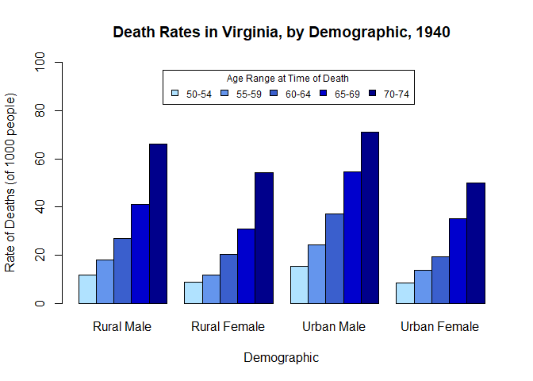

Hesse Activity 1, Github Repository Version
================
Sara Hesse
2026-10-06

<!-- README.md is generated from README.Rmd. Please edit that file -->

# my-GEO712-repository

<!-- badges: start -->

<!-- badges: end -->

The goal of my-GEO712-repository is to practice using Github. The
contents of the previous activity are given below:

My main research interest is tracking the impacts of climate change on
post-wildfire forest regrowth in Canada’s boreal forest over several
decades. The ***hypothesis is that increased atmospheric $CO_{2}$ will
lead to greater rates of evapotranspiration, and therefore, faster
regrowth and recovery.*** I will be assessing the change in *3 key
metrics* over several decades: **rate of canopy height regrowth, rate of
biomass regrowth, and rate of albedo recovery.** The study will average
forest recovery with fire years dating from the mid-1950s through to the
early 2000s. Satellite data will be used to make these assessments where
available, while machine learning will be used to simulate forest
conditions prior to the launch of Landsat 1. ***The goal of this
research is to determine if wildfires have had a net effect of warming
(due to the release of $CO_{2}$ during burning) or cooling (biophysical
mechanisms, such as increasing albedo from snow cover and deciduous
plant regrowth) on the global climate.*** This research is of *political
importance* with growing tensions with the USA, as they are currently
accusing Canada’s wildfires of global pollution, despite the net impact
of these wildfires on global climate remaining uncertain.

# Favourites

## Favourite Music

1.  *“Cherry Wine”* by Hozier
2.  *“Bobby”* by Phoebe Bridgers
3.  *“From Eden”* by Hozier
4.  *“Rich Girl”* by Hall & Oates
5.  *“Lithonia”* by Childish Gambino

## Favourite Equation

$$\frac{\partial u}{\partial t} + 6u \frac{\partial u}{\partial x} + \frac{\partial^3 u}{\partial x^3} = 0$$

My favourite equation is the *Korteweg-de Vries (KdV)* equation, which
is used to model nonlinear dispersive waves. In 2021, I was awarded an
NSERC USRA to work with another student at Brock University to find
multi-soliton solutions to the KdV-1 flow equation, under the
supervision of Dr. Stephen Anco.

## Favourite Artists

| Name | Achievements |
|----|----|
| Hozier | Grammy nominated for **Song of the Year** in 2015, for song *“Take Me to Church”* |
| Phoebe Bridgers | Won 4 Grammy awards in 2024 for **Best Alternative Music Album**, **Best Rock Performance**, **Best Rock Song** and **Best Pop Duo/Group Performance** |
| Hall & Oates | Inducted into the **Rock and Roll Hall of Fame** in 2014 |
| Childish Gambino | Won 5 Grammy awards (4 in 2019, 1 in 2018) for **Record of the Year**, **Song of the Year**, **Best Rap/Sung Performance**, **Best Music Video**, and **Best Traditional R&B Performance** |
| Olivia Rodrigo | Won 3 Grammy awards in 2022 for **Best New Artist**, **Best Pop Vocal Album**, and **Best Pop Solo Performance** |

# A Chunk of Code

``` r

palette <- c("lightskyblue1", "cornflowerblue", "royalblue3", "blue3", "darkblue")

barplot(
  height = VADeaths, 
  beside = T, 
  col = palette, 
  ylim = c(0,100),
  main = "Death Rates in Virginia, by Demographic, 1940",
  xlab = "Demographic",
  ylab = "Rate of Deaths (of 1000 people)",
  legend.text = rownames(VADeaths),
  args.legend = list(title = "Age Range at Time of Death", x = 20, horiz = T, cex = 0.75)
)
```

<!-- -->
